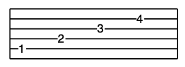

# TabScript

[](https://github.com/ashitani/tabscript/actions/workflows/tests.yml)


TabScriptは、ギターやベースのタブ譜を記述するためのシンプルなテキスト形式の言語です。

このレポジトリはTabscript言語の仕様と、処理系としてtabscriptという名称のPythonパッケージを提供します。

## TabScriptサンプル

```
5-1 4-2 3-3 2-4
```
という文字列を下記のようなpdfか、



あるいは下記のようなテキストに変換することができます。
                  
```
|----------------|
|-------------4--|
|---------3------|
|-----2----------|
|-1--------------|
|----------------|
```

TabScript言語の記法の詳細については[docs/format.md](docs/format.md)を参照してください。

## インストール

```bash
# PyPIからインストール (未実装)
# pip install tabscript

# ソースからインストール
git clone https://github.com/ashtiani/tabscript.git
cd tabscript
pip install .
```

## 使い方

### コマンドラインツール

```bash
# PDFとして出力
tab2pdf score.tab
tab2pdf tabs/*.tab   # 複数ファイルの一括処理

# テキストとして出力（タブ譜形式）
tab2txt score.tab
tab2txt tabs/*.tab   # 複数ファイルの一括処理
```

### Pythonコードでの使用

```python
import tabscript as ts

# TabScriptファイルのパース
parser = ts.parser()
parser.parse("path/to/your/score.tab")

# PDFとして出力
parser.render_score("output.pdf")

# テキストとして出力
parser.render_score("output.txt")
```


## 開発者向け情報

開発への参加方法、テスト方法、コーディング規約などについては[docs/development.md](docs/development.md)を参照してください。

## Todo
- スラー・タイ（ドキュメント書いたっけ？）
- 繰り返し、DS、Coda
- 三連符
- 各種奏法（ハンマリング、プリング、スライド、チョーキング）
- コメント（できたけどまだ途中#の処理がおかしい）
- 改ページ
- VSCode plugin
- HTML5+JS

## ライセンス

MIT License
